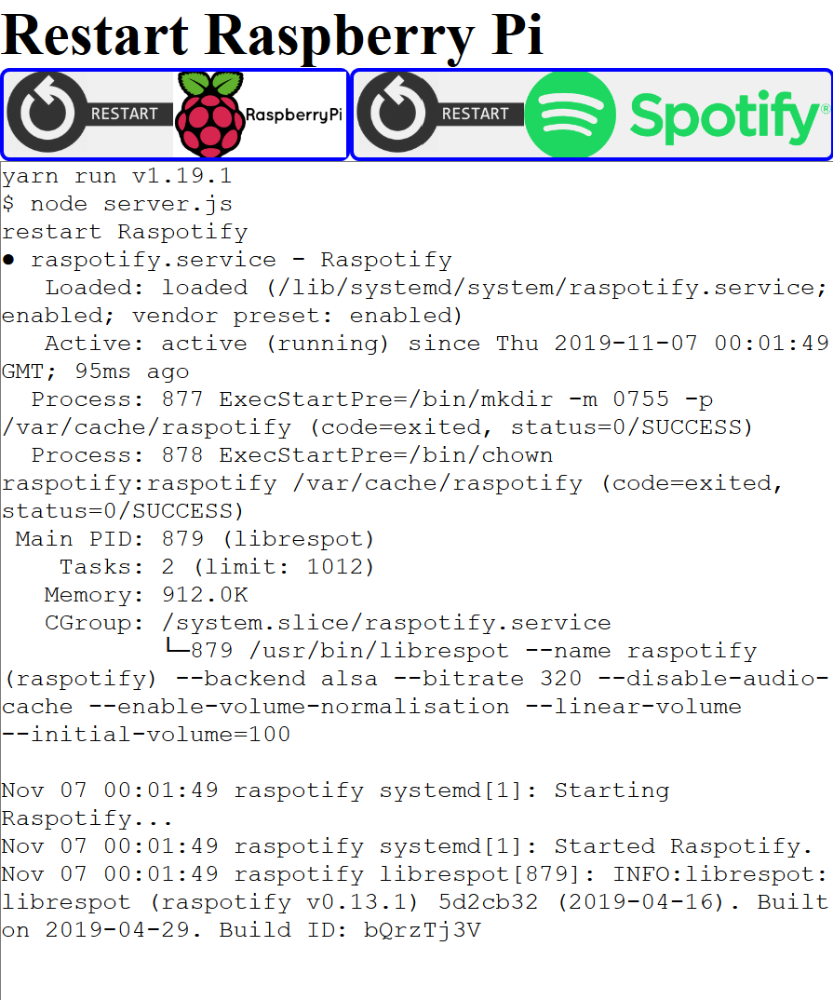

# Restart Pi

An easy deployable node server for easily restarting [raspotify](https://github.com/dtcooper/raspotify) service on a raspberry pi.
It is expected that a service named `raspotify` is registered on the raspberry pi.



## Install

Copy the deploy script and change the variables `RASPBERRY_PASSWORD` and `RASPBERRY_HOST` as needed for your setup: `mv deploy.example.sh deploy.sh`

On the raspberry pi, install node and yarn:

```sh
sudo su
apt-get update
apt-get -y install curl
apt-get install -my gnupg
curl -sL https://deb.nodesource.com/setup_10.x | bash -
curl -sS https://dl.yarnpkg.com/debian/pubkey.gpg | apt-key add -
echo "deb https://dl.yarnpkg.com/debian/ stable main" | tee /etc/apt/sources.list.d/yarn.list
apt-get update && apt-get -qqyy install nodejs yarn && rm -rf /var/lib/apt/lists/*
```
Create a new service `/etc/systemd/system/restart-pi.service` on the pi and copy over 
the content of the file `restart-pi.service`. Then enable the service with `sudo systemctl enable restart-pi.service` and start it with `sudo systemctl start restart-pi.service`

## Deploy the app

Make sure you have [sshpass](https://gist.github.com/arunoda/7790979) installed on your system

The app is deployed on port `3001`. Deploy the app with

```sh
./deploy.sh
```

Or you can manually configure the service on the raspberry pi.

1. Copy this project to the raspberry pi
2. Open a terminal and `cd` to the project folder. (The command `ls` should output all the files and folders of the project)
3. Run the following commands:

```sh
yarn install
sudo systemctl restart restart-pi
```

Then you can visit the restart-website under the ip of your raspberry pi on the port 3001 (e.g. 192.168.1.12:3001)
